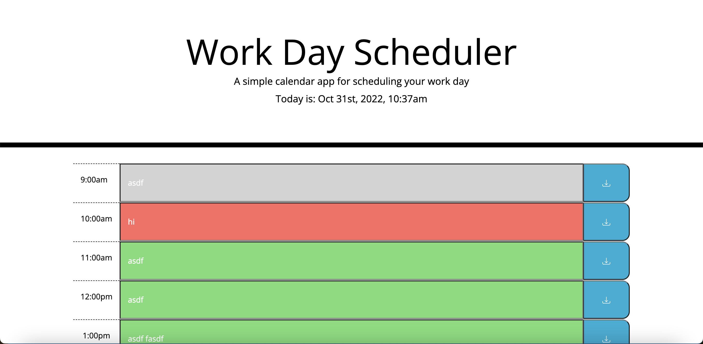
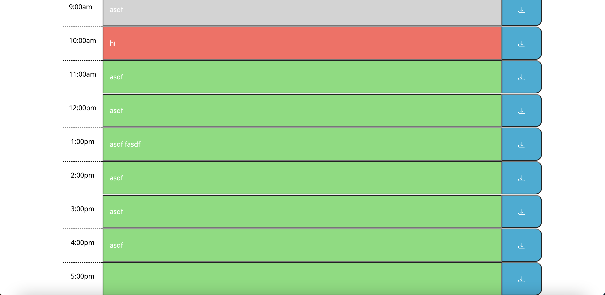

# Work Day Scheduler

Need to keep your daily work calendar organized? Then this is the app for you! This app runs in the browser and features dynamically updated HTML and CSS powered by JavaScript code that shows you the current hour and what tasks you've added to your to do list.  It makes sure you always know what time it is and what tasks you have to do given the current hour of day.  

## Description
This is a daily planner tool that displays the current day and time at the top of a calendar.  Below that there are timeblocks for standard business hours and when a user looks at the timeblocks, they will see that each one is color coded to indicate whether it is in the past, present, or future.  When a certain timeblock is clicked on, then a user can enter an event and click save. This event is then saved in local storage which means that if a user needs to exit the schedule or refresh the page, when they come back, those saved events will once again show up on the page.

## Installation
NA

## Usage
Any employee with a busy schedule can use this application to add important events to their daily planner.  It will help them maintain (or increase!) productivity by helping them manage their time more effectively.

## Credits
NA

## License

Please refer to the LICENSE in the repo.

## Screenshots

## Link to Deployed Website
[Link](https://sely1724.github.io/work-day-scheduler/)